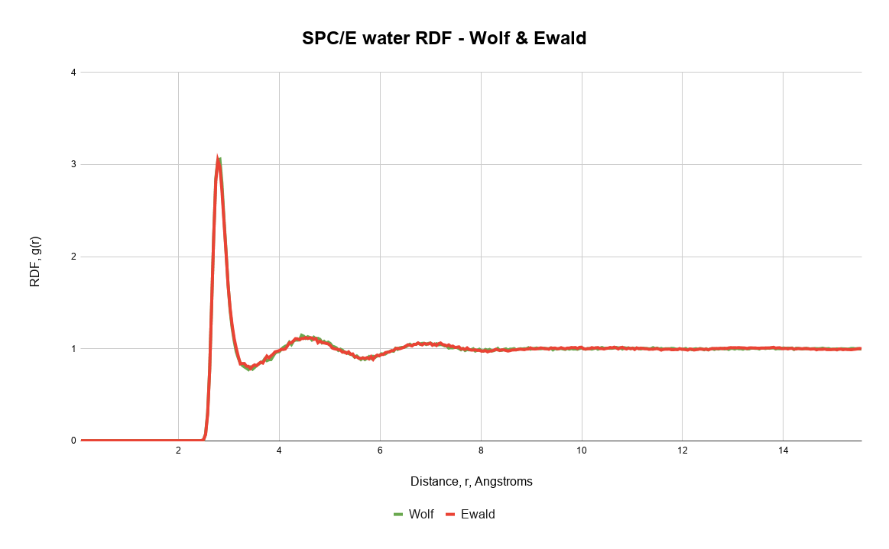
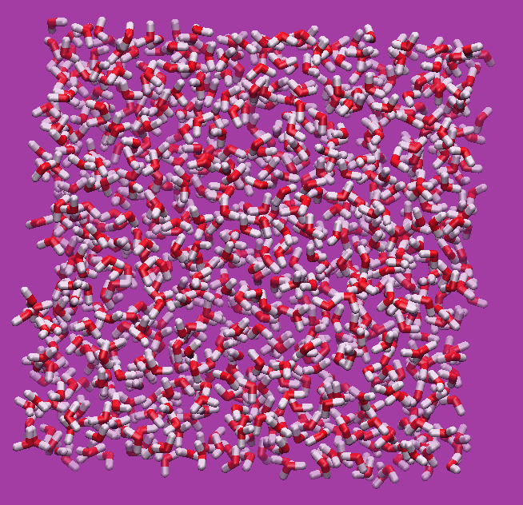

# QuixoticSimulating

# Metropolis Monte Carlo

Written in Julia for speed of development and also execution.

# Purpose:
This is my playground which will be used for testing new ideas and algorithms. At the moment it has working rigid polyatomics with Ewald or Wolf summation. I made this for myself, I will likely expand it to be extensible by others once I have fully implemented NVT/NPT for MC/MD and weighted Monte Carlo.

# Goals:
  1) add flexible molecules
  2) add force routines and provide molecular dynamics
  3) add free energy calculations
  4) add GPU support
  5) add ability to do adsorption

  # Proof of concept
  Here are some mediocre images from short runs to show it works :) It takes approximately 1 hour to do 10 million (translation + rotation) steps for 1000 SPC/E water molecules.

## Citing

See `CITATION.bib` for the relevant reference(s).
